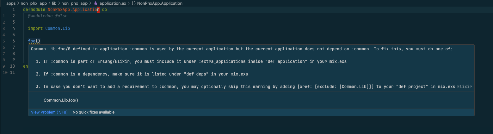
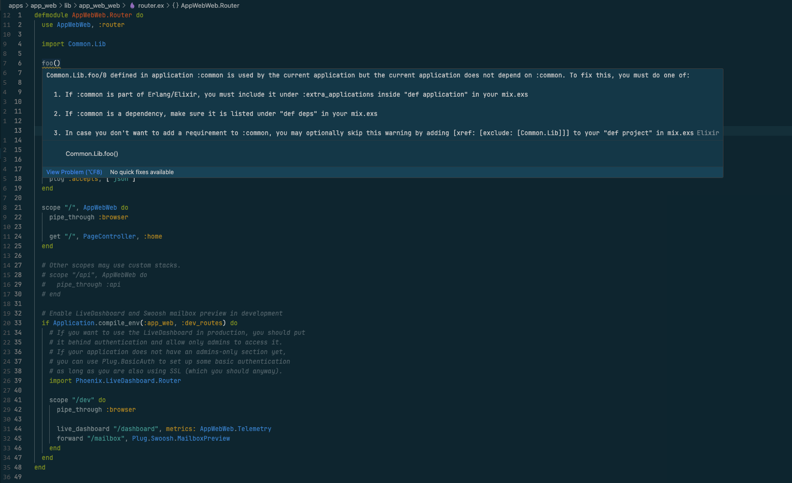

# ElixirLs Umbrella Issue

This repo aims to reproduce a weird dependency error in Umbrella app. This errors seems to happen only for ElixirLS (using VS Code with [JakeBecker.elixir-ls](https://marketplace.visualstudio.com/items?itemName=JakeBecker.elixir-ls) extension), neither dyalizer, credo or mix compile gives this warning.

## System info

macOS Version 13.3.1 (a) (22E772610a)

Erlang/OTP 25 [erts-13.2.2] [source] [64-bit] [smp:10:10] [ds:10:10:10] [async-threads:1] [jit]

Elixir 1.14.5 (compiled with Erlang/OTP 25)

VSCode Version: 1.79.0 Commit: b380da4ef1ee00e224a15c1d4d9793e27c2b6302

VSCode extension: jakebecker.elixir-ls v0.14.7

ElixirLS release v0.14.6
## What happen

Once imported `Common.Lib` from `apps/common/lib/common/lib.ex` (for example in `non_phx_app`'s `NonPhxApp.Application` or `app_web`'s `AppWebWeb.Router` module), I got the following warning:

```
Common.Lib.foo/0 defined in application :common is used by the current application but the current application does not depend on :common. To fix this, you must do one of:

  1. If :common is part of Erlang/Elixir, you must include it under :extra_applications inside "def application" in your mix.exs

  2. If :common is a dependency, make sure it is listed under "def deps" in your mix.exs

  3. In case you don't want to add a requirement to :common, you may optionally skip this warning by adding [xref: [exclude: [Common.Lib]]] to your "def project" in mix.exsElixir
Common.Lib.foo()
```
although `common` dependency is correctly imported with `{:common, in_umbrella: true}` in `mix.exs` file of the other application

This is the output from ElixirLS:

```
[Info  - 11:26:01] Starting build with MIX_ENV: test MIX_TARGET: host
==> non_phx_app
Compiling 1 file (.ex)
[Warn  - 11:26:01] warning: Common.Liba.boo/0 defined in application :common is used by the current application but the current application does not depend on :common. To fix this, you must do one of:

  1. If :common is part of Erlang/Elixir, you must include it under :extra_applications inside "def application" in your mix.exs

  2. If :common is a dependency, make sure it is listed under "def deps" in your mix.exs

  3. In case you don't want to add a requirement to :common, you may optionally skip this warning by adding [xref: [exclude: [Common.Liba]]] to your "def project" in mix.exs

  lib/non_phx_app/application.ex:8: NonPhxApp.Application

[Warn  - 11:26:01] warning: Common.Liba.foo/0 defined in application :common is used by the current application but the current application does not depend on :common. To fix this, you must do one of:

  1. If :common is part of Erlang/Elixir, you must include it under :extra_applications inside "def application" in your mix.exs

  2. If :common is a dependency, make sure it is listed under "def deps" in your mix.exs

  3. In case you don't want to add a requirement to :common, you may optionally skip this warning by adding [xref: [exclude: [Common.Liba]]] to your "def project" in mix.exs

  lib/non_phx_app/application.ex:6: NonPhxApp.Application

[Warn  - 11:26:01] warning: Common.Liba.foo/0 defined in application :common is used by the current application but the current application does not depend on :common. To fix this, you must do one of:

  1. If :common is part of Erlang/Elixir, you must include it under :extra_applications inside "def application" in your mix.exs

  2. If :common is a dependency, make sure it is listed under "def deps" in your mix.exs

  3. In case you don't want to add a requirement to :common, you may optionally skip this warning by adding [xref: [exclude: [Common.Liba]]] to your "def project" in mix.exs

  lib/app_web_web/router.ex:6

[Info  - 11:26:01] Compile took 561 milliseconds
[Info  - 11:26:01] [ElixirLS Dialyzer] Checking for stale beam files
[Info  - 11:26:01] [ElixirLS WorkspaceSymbols] Updating index...
[Info  - 11:26:02] [ElixirLS Dialyzer] Found 3 changed files in 88 milliseconds
[Info  - 11:26:02] [ElixirLS Dialyzer] Analyzing 0 modules: []
[Info  - 11:26:02] [ElixirLS Dialyzer] Analysis finished in 12 milliseconds
[Info  - 11:26:02] Dialyzer analysis is up to date
[Info  - 11:26:02] [ElixirLS WorkspaceSymbols] 1 modules need reindexing
[Info  - 11:26:02] [ElixirLS WorkspaceSymbols] 0 callbacks added to index
[Info  - 11:26:02] [ElixirLS WorkspaceSymbols] 0 types added to index
[Info  - 11:26:02] [ElixirLS WorkspaceSymbols] 1 modules added to index
[Info  - 11:26:02] [ElixirLS WorkspaceSymbols] 4 functions added to index
[Info  - 11:26:02] [ElixirLS Dialyzer] Writing manifest...
[Info  - 11:26:02] [ElixirLS Dialyzer] Done writing manifest in 722 milliseconds.
```
## Caveats

If your are not able to get this warning, just rename the `Common.Lib` module and its import in `non_phx_app`'s `NonPhxApp.Application` and/or `app_web`'s `AppWebWeb.Router` module.
## Screenshots

Module `NonPhxApp.Application` in `apps/non_phx_app/lib/non_phx_app/application.ex`



Module `AppWebWeb.Router` in `apps/app_web/lib/app_web_web/router.ex`

